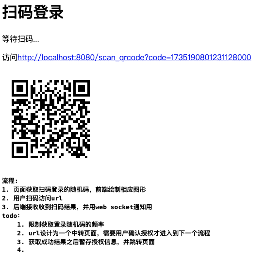
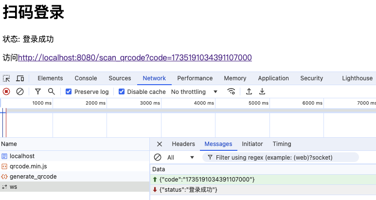

# 扫码登录 golang实现

用docker 启动一个root密码为 root 的数据库，并创建 创建数据库

```SQL
CREATE DATABASE testdb
CHARACTER SET utf8mb4
COLLATE utf8mb4_general_ci;
```

1. 页面获取扫码登录的随机码，前端绘制相应图形
2. 用户扫码访问url
3. 后端接收收到扫码结果，并用web socket通知用
   todo：
    1. 限制获取登录随机码的频率
    2. url设计为一个中转页面，需要用户确认授权才进入到下一个流程
    3. 获取成功结果之后暂存授权信息，并跳转页面
    4. 随机码存储到redis中（附带TTL并且要防止被刷爆）



